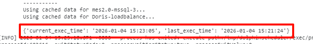
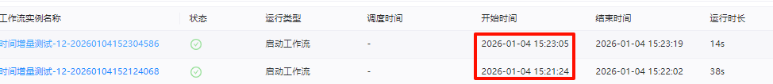
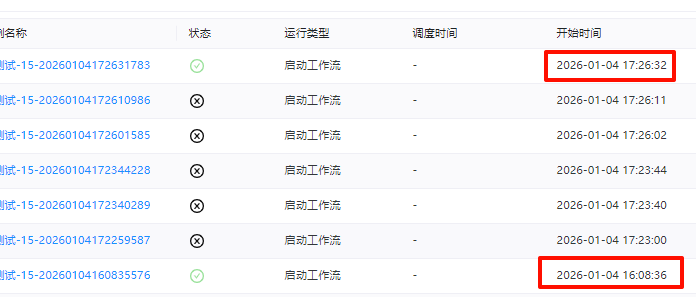
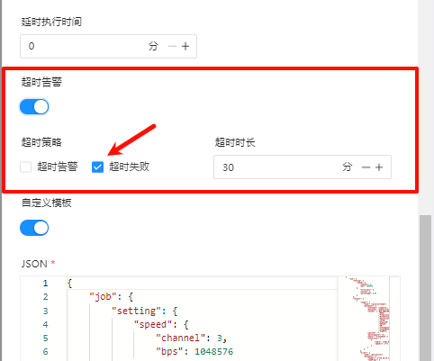
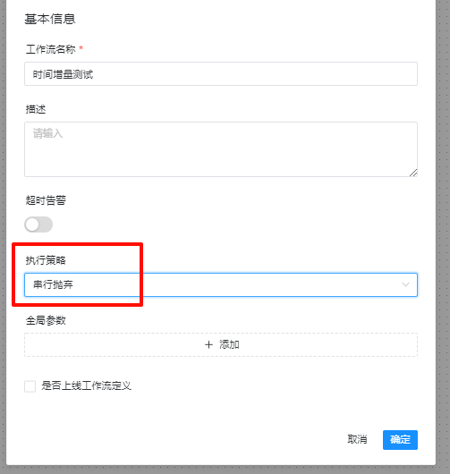

# datax-modify
基于dolphinscheduler调度的Datax，利用dolphinscheduler的特性对Datax启动脚本进行修改，将本次执行时间和上次执行时间作为参数注入到Datax任务启动命令中，实现基于时间的增量数据同步。

## 使用方法：
sql：
```sql
select * from table 
where CreateDate >= '${last_exec_time}' and CreateDate < '${current_exec_time}'
```
自定义模版：
```TEXT
"where": "CreateDate >= '${last_exec_time}' and CreateDate < '${current_exec_time}'"
```
执行情况：


中间多次失败的情况：


## 修改说明
本代码只包含修改的部分，复制到对应目录中即可。
datax.py修改部分：

dstool.py中提供了两个获取执行时间的方法，分别从数据库和api中获取，api有一定的局限性，返回报文较长，默认只获取三条记录，如果前面两次都失败则转向数据库获取，如果需要获取更多记录可修改pageSize及对应的逻辑，根据需要选择使用。

## 特别注意：
1. 需要考虑任务卡住（一直保持运行状态），需在任务配置中添加超时时间，防止任务卡住之后时间获取混乱。

2. 执行策略建议选择：**串行抛弃**，避免多个调度同时执行。
